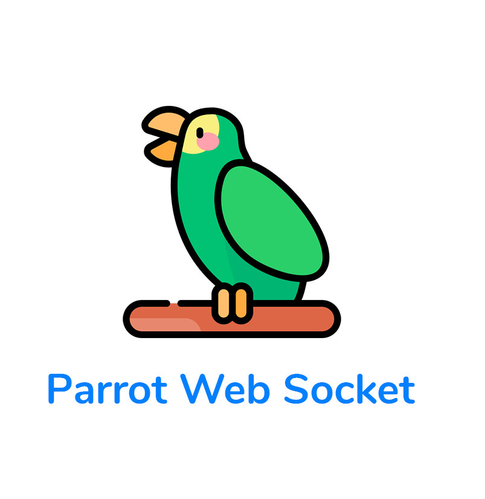
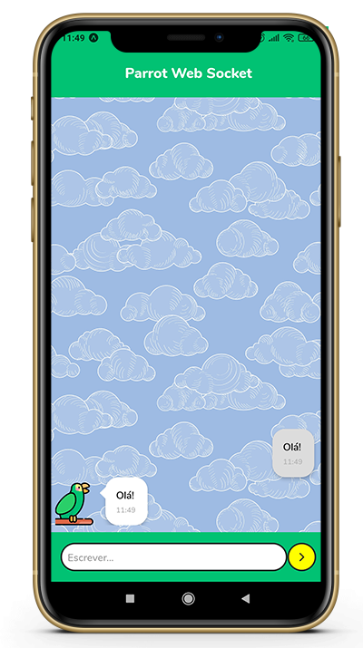

<h1 align="center">
    
</h1>

                                                                                                                                           

  🐦 Aplicativo mobile simulador de papagaio para livro infantil - desafio proposto pela Codificar

## 💡 Tecnologias utilizadas
- [Node.js](https://nodejs.org/en/): Rutime Javascript e gerenciador de pacotes
- [React Native](https://facebook.github.io/react-native/): Framework react para desenvolvimento mobile
- [Expo](https://expo.io/): Ferramenta para ambiente de desenvolvimento React Native
- (Opcional) [Yarn](https://yarnpkg.com/): Gerenciador de pacotes otimizado

## 📜 Instruções para ambiente de desenvolvimento

1. Certifique-se que sua máquina possui a versão estável mais recente do Node Js juntamente com seu gerenciador de pacotes que podem ser baixados no link da lista de tecnologias acima.

2. Com a instalação do Node e o download deste projeto, entre no diretório e execute o comando `npm install` (ou `yarn install`, caso prefira usar yarn). Isso baixará todos os módulos necessários para o projeto e pode levar alguns instantes.

3. Instale a interface de linha de comando do Expo como dependência global em sua máquina com o comando `npm install --global expo-cli` (ou `yarn global add expo-cli`). Também é possível executar os comandos expo remotamente trocando _expo_ por _npx expo_ nas instruções abaixo.

4. Após instalar a depêmcia Expo, execute o comando `expo start` dentro do diretório. Um servidor de ambiente de desenvolvimento será iniciado na sua máquina com opções para abrir o aplicativo no navegador, em um simulador de smartphone local, ou em seu smartphone físico de acordo com a instrução abaixo.

5. Para abrir o aplicativo em seu smartphone (Android ou iOS) é possível utilizar o aplicativo da Expo disponível na loja de aplicativos. Baixado o aplicativo, basta usar o leitor de QR Code na imagem disponível no servidor de desenvolvimento de sua máquina (Obs.: É possível utilizar diferentes caminhos nas opções do servidor para transmissão do aplicativo como LAN ou Tunel caso haja problemas na rede).

## 🔧 Build e ambiente de produção
É possível gerar builds com os scripts da expo `expo build:android -t apk` ou `expo build:ios arquive` que irão gerar na plataforma da expo arquivos baixáveis para instalção no dispositivo. Para isso é preciso uma conta Expo, basta seguir as instruções no terminal para criar uma conta ou efetuar login.

* [Download APK (55 MB)](https://drive.google.com/file/d/1E2EY2XjixgZafRk-9KMZBHdd97AZcdRH/view?usp=sharing)
